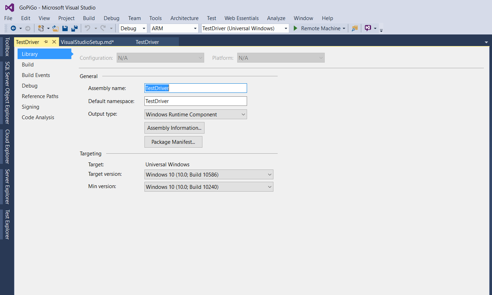
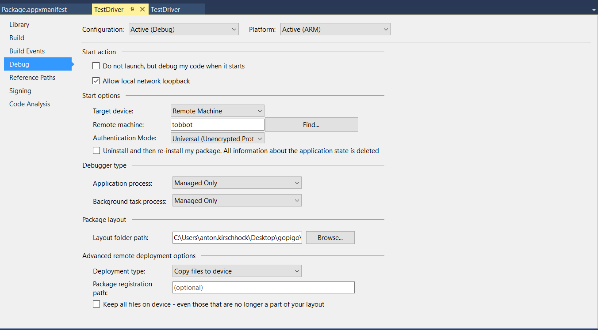

# GoPiGo & Visual Studio 2015 #

## Setup the project
First of, Download the released dll (Debug or Release) under the Release tab on github:
https://github.com/tobania/GoPiGo.Net/releases

*Optional you can download the full source code and reference that in your project.*

Now create a new IOT Background task:

1) in Visual Studio 2015, File, New Project

2) Select Background Application (IoT), under Visual C#, Windows, Windows Iot Core

3) Reference the downloaded DLL files (or the sourcecode) and try a clean build.

No errors should pop up.

## Setting up the Project ##
To setup the project  we will need to configure our target device in the project settings:
1) Set the build target for the Background task from **Any target** to **ARM**.
2) Open the **properties** screen of our created background task.
3) Following screen will appear:

4) From this screen you can edit the app manifest, to allow features such as file system, internet, bluetooth,...
   * For that click on **Package Manifest**, followed by opening the tab Capabilities. Here select the feature you need.
   * More info on this topic, you can find on https://msdn.microsoft.com/en-us/windows/uwp/devices-sensors/enable-device-capabilities
5) Goto The **Build** Tab. Following screen will appear:

6) Make sure the current platform is **ARM**. Set the following configurations:
 - Target device: Remote machine. The Run Arrow on top should change to Remote Device: 
 - Remote machine: The IP or host name of your robot. You can try the find button, but this not allways works in some instances.
 - Authentication mode: Universal (Unencrypted Protocol)

If you have setup a debug pin in the dashboard, you will be prompted to enter the pin, the first time you deploy the app.
## Common build errors ##

It can happen that a few issues can occur, during release.
Most are  related to the network issues. To troubleshoot network issues:
1) Can I ping my robot?
  * Yes: goto 2
  * No: Try connecting the ethernet cable directly to your robot. Please reconnect power to the raspberry pi to ensure that the pi uses the wired connection. Try again step 1.

2) Can I access the webpage of the robot?
   * Yes: Continue with build configuration issues below:
   * No: Try reconnecting power to the Pi

Build issues can happen due to invalid build configurations in Visual Studio:
In this case follow the steps of **Setting up the Project**

If the steps above not resolves the issues, restart Your Robot followed by Visual Studio.
If that still fails to help, shutdown the robot, Close Visual Studio, [Clear your MEF cache](https://marketplace.visualstudio.com/items?itemName=MadsKristensen.ClearMEFComponentCache#user-content-what-does-it-do), Restart your PC, Start you robot, followed by Visual Studio after you were able to ping your robot.

***Note**: Clearing your MEF cache can resolve issues in Visual Studio. You can install a small tool under https://marketplace.visualstudio.com/items?itemName=MadsKristensen.ClearMEFComponentCache which really helps to resolve weird errors!*

