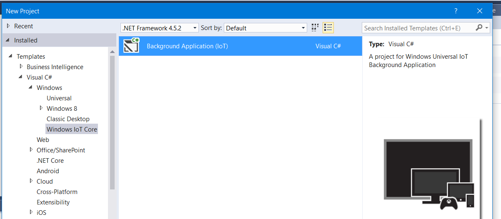

# GoPiGo & Visual Studio 2015 #

//TODO TALK ABOUT HOW TO CONNECT
## Setup the project
First of, Download the released dll (Debug or Release) under the Release tab on github:
https://github.com/tobania/GoPiGo.Net/releases

*Optional you can download the full source code and reference that in your project.*

Now create a new IOT Background task:

1) in Visual Studio 2015, File, New Project
2) Select Background Application (IoT), under Visual C#, Windows, Windows Iot Core

3) Reference the downloaded DLL files (or the sourcecode) and try a clean build.

No errors should pop up.

##Configuring the GoPiGo as device##

//TODO TALK ABOUT COMMON ISSUES WITH RELEASING
